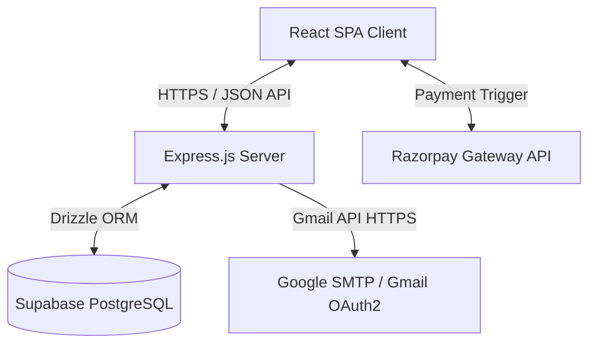
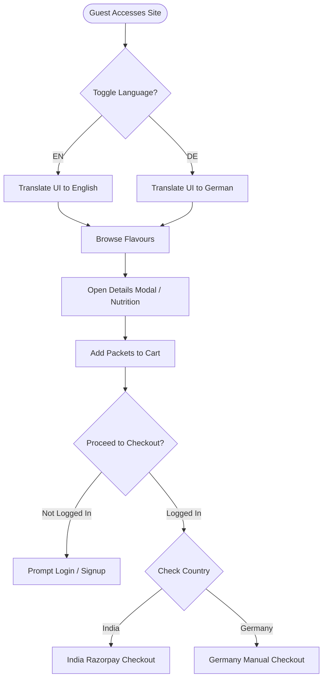
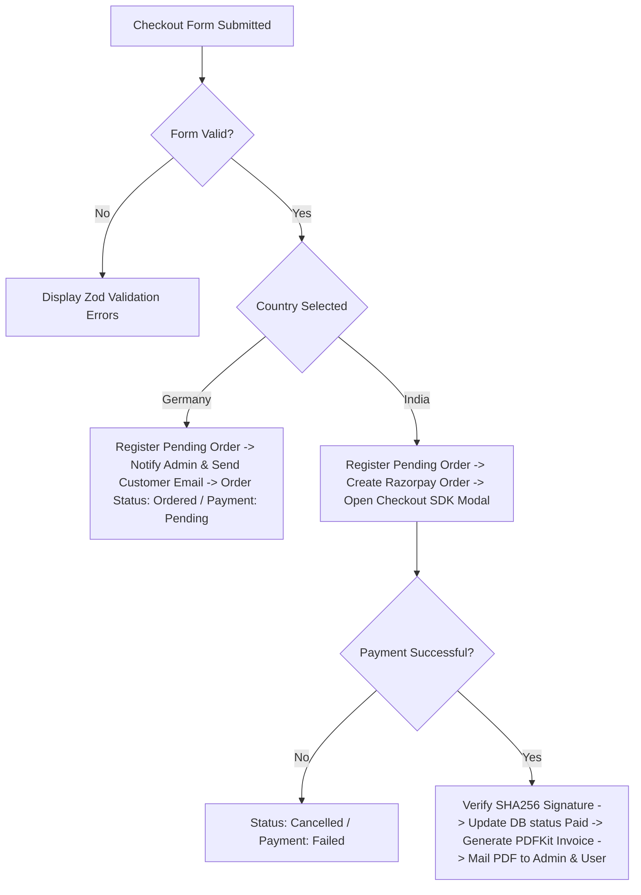
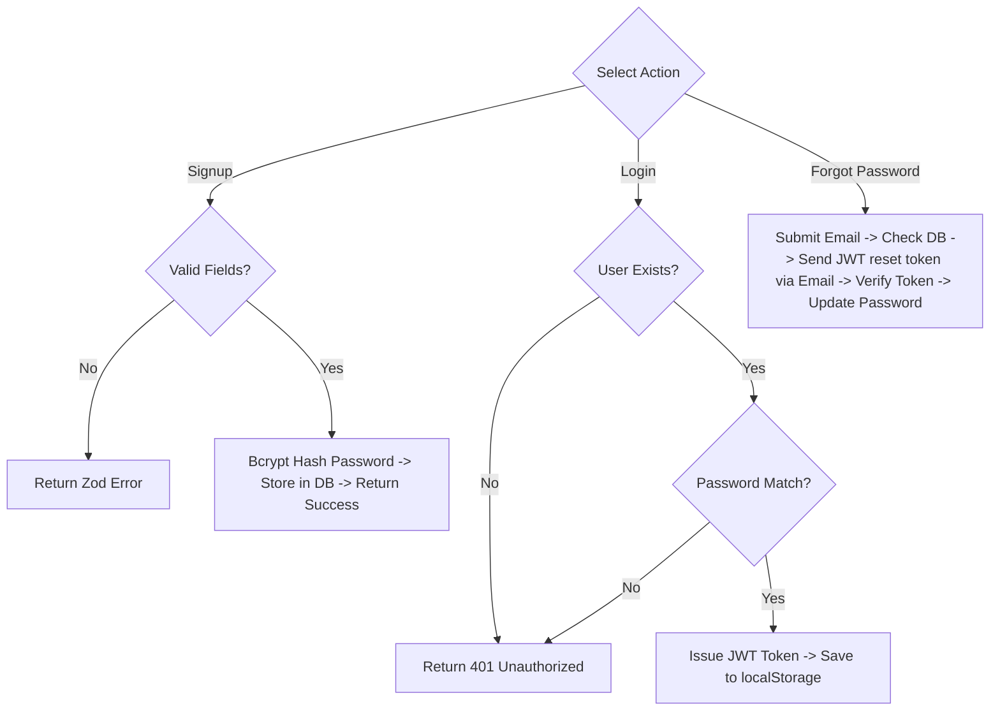
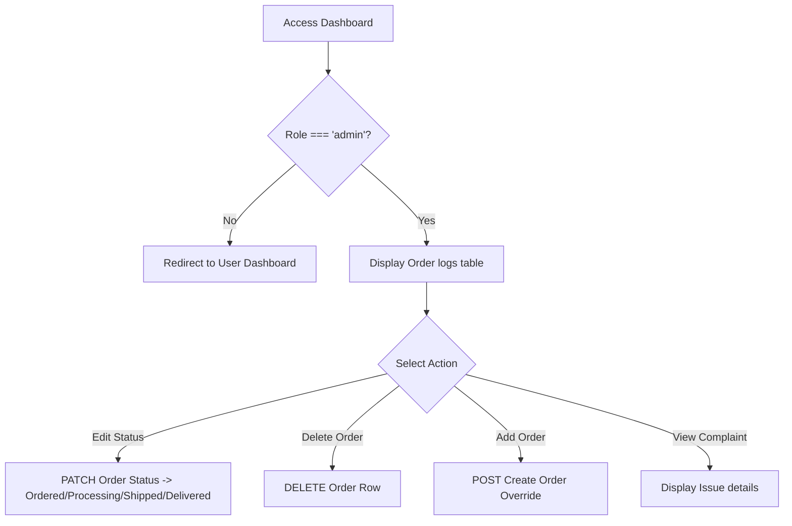

# POPTUM Master Internship Documentation
**B.Tech Summer Internship Technical Reference Document**  
*Target: Summer Internship Report, Internship Presentation, and Viva Voce Preparation*

---

## Chapter 1: Executive Summary & Project Overview

### 1.1 Project Metadata
* **Project Name**: POPTUM E-Commerce & Dynamic Catalog Platform
* **Brand Name**: POPTUM
* **Parent/Marketing Company**: MOFORCE EXIM (Rajkot, Gujarat, India)
* **Manufacturing Partner**: Tirhuthwala Innovations Pvt. Ltd. (Samastipur, Bihar, India)
* **Domain**: Food & Beverage, E-Commerce, International Export, Agricultural Supply Chain
* **Project Type**: Full-Stack Web Application (B2C Showcase and Localized Checkout Portal)

### 1.2 Brief Introduction
POPTUM is an international, full-stack e-commerce and catalog web platform designed to facilitate the distribution, marketing, and sale of premium roasted foxnuts (commonly known as Makhana or Popped Water Lily Seeds) from India to international markets, with a primary focus on Germany and the United Kingdom. The platform bridges the traditional agricultural harvesting networks of Bihar, India, with European B2B and B2C clients, providing a localized shopping experience, compliant tax calculation (GST in India, VAT in Germany), and automatic invoicing.

---

## Chapter 2: Business Understanding

### 2.1 What Moforce Exim Does
Moforce Exim is an international trade and export enterprise based in Rajkot, Gujarat, India. The company specializes in identifying agricultural products with high nutritional value, sourcing them directly from local producers, and marketing them globally. Moforce Exim manages the supply chain, compliance, branding, and export logistics to deliver Indian superfoods to Western consumer markets.

### 2.2 What POPTUM Is
POPTUM is a direct-to-consumer (D2C) and business-to-business (B2B) brand established by Moforce Exim. It represents a premium line of roasted, seasoned Makhana snacks. The brand focuses on healthy, guilt-free snacking under the tagline *"Pop • Crunch • Repeat"*. The POPTUM web platform serves as the digital storefront and catalogue showcase for this brand.

### 2.3 Why Makhana Has Export Potential
Makhana is a natural superfood with an exceptional nutritional profile:
* **High Nutritive Value**: It is low in cholesterol, fat, and sodium, yet high in protein, fiber, magnesium, potassium, and calcium.
* **Allergen-Free**: It is naturally gluten-free and vegan, aligning with global dietary trends.
* **High Antioxidants**: Rich in natural antioxidants, making it a functional health food.
* **Premium Positioning**: Makhana is highly valued in international markets as an organic, clean-label alternative to starch-heavy potato chips and corn snacks.

### 2.4 Why Germany and Europe Were Targeted
Germany and the broader European Union represent some of the fastest-growing markets for organic and healthy snacks:
* **Health Consciousness**: A significant demographic in Germany actively seeks nutrient-dense, allergen-free snack alternatives.
* **High Purchasing Power**: European consumers are willing to pay a premium for organic, certified, and sustainably sourced foods.
* **Market Gap**: While popular in India, Makhana remains relatively unknown in Germany, presenting a first-mover advantage for Poptum.

### 2.5 What Business Problems the Website Solves
* **Market Awareness**: Introduces international buyers to Makhana through a bilingual (English/German) educational and cultural showcase.
* **Payment Accessibility**: Integrates localized checkout pipelines (Razorpay for INR transactions in India, and a structured manual order system for EUR in Germany).
* **Tax Compliance**: Automates the computation of Indian GST (CGST/SGST/IGST depending on shipping origin) and German VAT (7% inclusive rate).
* **Process Automation**: Automates order registration, PDF invoice generation, and transactional email distribution, reducing manual administrative effort.

---

## Chapter 3: System Analysis

### 3.1 Existing System
Prior to the development of the POPTUM platform, the export and sales workflow was managed manually:
* Inquiries were collected via email, phone, or messaging apps.
* Prices, bulk discounts, and shipping charges were calculated manually.
* Local taxes (GST for India, VAT for Germany) were calculated using spreadsheets.
* Invoices were drafted manually in word processors and emailed as attachments.
* Orders, payment verification, and delivery tracking were logged manually in local spreadsheets.

### 3.2 Problems in the Existing Process
* **In-efficiency**: Manual calculation and document draft cycles caused long delays.
* **Human Error**: Manual tax computations were prone to errors, risking tax compliance issues.
* **No Real-Time Payment**: Domestic buyers had no instant payment option, requiring manual bank transfers and verification.
* **Limited Reach**: Lacked an interactive, bilingual digital presence to build trust with international buyers.
* **Admin Burden**: Business owners spent considerable time managing administrative tasks rather than focusing on scaling operations.

### 3.3 Proposed System
The proposed POPTUM platform is a full-stack web application designed to automate the sales, compliance, and invoicing pipeline:
* **Interactive Frontend**: A responsive React SPA presenting product catalogs, nutritional comparisons, and agricultural harvesting backgrounds.
* **Automated Pricing & Tax Engines**: Handles currency formatting and computes local taxes (5% GST in India, 7% VAT in Germany) automatically.
* **Integrated Payments**: Provides instant Razorpay checkouts for domestic customers.
* **Dynamic Invoicing**: Generates sequential PDF tax invoices instantly upon payment.
* **Mailing Service**: Dispatches customer confirmation emails and admin alerts immediately.
* **Back-Office Dashboard**: A secure portal for administrators to manage orders, update fulfillment statuses, and review metrics.

### 3.4 Advantages of the Proposed System
* **Automation**: Eliminates manual invoicing and tax calculation steps.
* **Compliance**: Automatically resolves GST CGST/SGST/IGST compliance rules for India checkouts.
* **Accessibility**: Offers instant card and UPI payments in India, and localized order requests in Germany.
* **Bilingual Engagement**: Enhances brand trust in Europe through native German translation support.
* **Scalability**: Centralizes order and status tracking, enabling Moforce Exim to handle higher order volumes.

---

## Chapter 4: Project Objectives

The POPTUM platform achieved the following core objectives:
* **Bilingual Showcase**: Implemented full translation support for English and German across all user interfaces.
* **Automated Financial Rules**: Programmed automated calculations for unit pricing, bulk discounts, shipping fees, Indian GST, and German VAT.
* **Dynamic Invoicing**: Developed an in-memory PDF generation engine to compile tax invoices on the fly.
* **Integrated Checkouts**: Implemented Razorpay payment processing for India and a structured manual order system for Germany.
* **Administrative Controls**: Built a secure admin dashboard to allow order tracking, manual order overrides, status updates, and deletion.
* **Feedback Systems**: Deployed a live rating widget and contact form to capture and analyze consumer feedback.

---

## Chapter 5: Technology Stack & Tools Used

### 5.1 Tools Used Table

| Tool / Library | Purpose | Rationale |
| :--- | :--- | :--- |
| **React** | Frontend UI Framework | Component-driven architecture, virtual DOM updates, and state management. |
| **TypeScript** | Static Typing | Provides compile-time type safety across the client and server. |
| **Express** | Backend REST API Framework | Lightweight, modular routing middleware for Node.js. |
| **Node** | JavaScript Runtime | Serves as the high-performance engine powering the backend server. |
| **PostgreSQL** | Relational Database | Reliable, ACID-compliant storage for transactional orders. |
| **Supabase** | Cloud Database Hosting | Scalable cloud PostgreSQL database with integrated connection pooling. |
| **Drizzle ORM** | Object-Relational Mapping | Offers type-safe database queries and automated schema migrations. |
| **TailwindCSS** | UI Styling | Utility-first CSS framework for rapid responsive design styling. |
| **Framer Motion** | UI Animations | Implements smooth entrance transitions, scroll effects, and tickers. |
| **JWT** | Session Authentication | Generates stateless secure tokens for administrative portal access. |
| **Bcrypt** | Password Hashing | Secures administrator database credentials using 10 salt rounds. |
| **Razorpay** | Payment Gateway | Handles domestic credit card and UPI transactions in India. |
| **PDFKit** | PDF Document Generation | Compiles vector-based tax invoices in-memory. |
| **Nodemailer** | Email Delivery | Manages transactional and notification email dispatches. |
| **Render** | Backend App Hosting | Hosts the compiled Node.js Express server. |
| **Vercel** | Frontend Web Hosting | Hosts the static React client assets via a global CDN. |
| **GitHub** | Version Control | Manages codebase history, staging, and collaboration. |
| **VS Code** | Integrated Development Environment | Primary editor used for development, debugging, and testing. |

---

## Chapter 6: Software Development Life Cycle (SDLC)

The project followed the **Agile methodology**, utilizing iterative development cycles to translate business requirements into functional features.

### 6.1 Requirement Gathering
In collaboration with Moforce Exim, requirements were gathered regarding agricultural supply chains, domestic Indian GST compliance, German VAT calculations, bulk discount thresholds, and preferred payment flows for India and Germany.

### 6.2 Design
The UI/UX was designed to be clean, modern, and mobile-friendly. Wireframes focused on product presentation, comparison charts, and store listings. The database schema was modeled in Drizzle ORM to map users, orders, order items, and invoices.

### 6.3 Development
Development was split into front-end and back-end modules. The client was built using React and TailwindCSS, while the server was built using Express.js. Drizzle ORM queries were integrated for database access.

### 6.4 Testing
Unit and integration testing focused on checkout validations (Zod schemas), payment signature verification, invoice generation alignment, and responsive UI scaling.

### 6.5 Deployment
The database was deployed to Supabase, the backend server to Render, and the static frontend assets to Vercel and Render static middleware, using custom environment variables.

### 6.6 Maintenance
Database migration scripts were written to apply schema updates, and a background cleanup script was configured to cancel unpaid pending orders after 15 minutes.

---

## Chapter 7: System Design & Architecture

### 7.1 Overall System Architecture
The platform follows a decoupled multi-tier layout: React frontend assets are distributed via a CDN, API logic is managed by an Express.js server on Render, and data is stored in a Supabase PostgreSQL instance.

### 7.2 User Flow
Shows how a guest user interacts with the application, toggling languages, selecting products, adding to cart, logging in, or checking out.

### 7.3 Checkout Workflow
Details the logical steps taken during transaction submission for both domestic (India) and international (Germany) regions.

### 7.4 Authentication Flow
Illustrates how the user signup, login, session checking, and password recovery workflows operate.

### 7.5 Admin Workflow
Shows administrative access controls to manage operational databases.

---

## Chapter 8: Database Design

The database schema is defined in [schema.ts](file:///c:/Users/RUTVIJ\OneDrive\Desktop\POPTUM2\PoptumCatalog2\shared\schema.ts) using Drizzle ORM.

### 8.1 Users Table (`users`)
* **Purpose**: Stores registered buyer profiles and dashboard administrator credentials.
* **Key Columns**:
  * `id` (`varchar`): Primary key, UUID.
  * `firstName` (`text`), `lastName` (`text`): User information.
  * `email` (`text`), `phone` (`text`): Contact data.
  * `country` (`text`): Region configuration (`"India"`, `"Germany"`).
  * `username` (`text`), `password` (`text`): Login credentials and Bcrypt password hash.
  * `role` (`text`): Role configuration (`"user"`, `"admin"`).

### 8.2 Orders Table (`orders`)
* **Purpose**: Records transaction totals, tax breakdowns, and customer shipping details.
* **Key Columns**:
  * `id` (`varchar`): Primary key, UUID.
  * `orderId` (`text`): Unique transaction invoice code (`POPTUM-xxxxx-yyyyy`).
  * `language` (`varchar`): Active checkout language (`"en"`, `"de"`).
  * `fullName` (`text`), `email` (`text`), `phone` (`text`), `address` (`text`), `city` (`text`), `postalCode` (`text`), `state` (`text`), `country` (`text`): Billing and shipping address coordinates.
  * `subtotal` (`numeric`), `tax` (`numeric`), `delivery` (`numeric`), `shipping` (`numeric`), `grandTotal` (`numeric`): Billing totals.
  * `status` (`text`): Order cycle state (`"Ordered"`, `"Processing"`, `"Shipped"`, `"Delivered"`, `"Cancelled"`).
  * `paymentStatus` (`text`): Payment status (`"pending"`, `"paid"`, `"failed"`).
  * `paymentExpiresAt` (`timestamp`): Expiration constraint for active sessions.
  * `transactionId` (`text`), `razorpayOrderId` (`text`): Payment transaction keys.

### 8.3 Order Items Table (`order_items`)
* **Purpose**: Links purchased products and quantities back to orders.
* **Key Columns**:
  * `id` (`varchar`): Primary key, UUID.
  * `orderId` (`varchar`): Foreign key referencing `orders.id` (cascades on delete).
  * `productName` (`text`): Product name.
  * `quantity` (`integer`): Units purchased.
  * `unitPrice` (`numeric`), `totalPrice` (`numeric`): Pricing calculations.

### 8.4 Site Ratings Table (`site_ratings`)
* **Purpose**: Stores rating feedback.
* **Key Columns**:
  * `id` (`varchar`): Primary key, UUID.
  * `rating` (`integer`): Rating value (1-5).
  * `createdAt` (`timestamp`): Submission timestamp.

---

## Chapter 9: Screens Developed

The application layout is responsive and scales to support mobile viewports, tablets, and desktop monitors.

| Screen Name | Purpose | Major Features |
| :--- | :--- | :--- |
| **Landing Page** | Primary showcase and brand introduction. | Responsive navigation, warning announcement bar, flavor catalog cards, and PM recognition media section.   *[Screenshot to be inserted in report.]* |
| **Login** | Secure administrative credentials validator. | Form validation, password visibility toggle, and login status alerts.   *[Screenshot to be inserted in report.]* |
| **Signup** | User profile registration form. | Fields validation, password strength checker, and region configuration selector.   *[Screenshot to be inserted in report.]* |
| **User Dashboard** | Order history lookup for logged-in buyers. | Lists previous orders, shipment statuses, and payment states.   *[Screenshot to be inserted in report.]* |
| **Admin Dashboard** | Central operational control center. | Interactive order database logs, status dropdown updates, manual overrides, delete confirm dialogs, and rating counters.   *[Screenshot to be inserted in report.]* |
| **Checkout Popup** | Checkout configuration checkout form. | Dynamic fields, Indian states validator dropdown, pricing line items, and GST/VAT calculations display.   *[Screenshot to be inserted in report.]* |
| **Password Reset** | Credential recovery portal. | Expiration-validated token authorization check and new password creation.   *[Screenshot to be inserted in report.]* |
| **Privacy Policy** | Legal disclaimer outlining user data policy. | Details terms of use and compliance regulations.   *[Screenshot to be inserted in report.]* |
| **Terms & Conditions** | General customer purchase contract layout. | Displays delivery guarantees and dispute resolution parameters.   *[Screenshot to be inserted in report.]* |

---

## Chapter 10: Core Modules & Functionalities

### 10.1 Customer Capabilities
* **Interactive Catalog**: Displays flavors with taste profiles and nutritional information.
* **Shopping Cart**: Automatically calculates pricing, applying bulk discounts (5+ packets) and free shipping thresholds.
* **Bilingual Support**: Implements an English/German translation switcher.
* **Retail Presence**: Lists retail partners in Germany and the UK with Google Maps navigation links.
* **Contact & Reviews**: Allows users to send feedback messages and submit 1–5 star ratings.

### 10.2 Administrative Capabilities
* **Order Management Dashboard**: Provides a tabular overview of order logs with status editing, manual order creation, and order deletion features.
* **Issue Log Viewer**: Allows admins to view specific customer complaints.
* **Rating Analytics**: Tracks and displays overall page feedback statistics.

### 10.3 Tax & Localization Engines
* **Indian GST**: Automates calculation of CGST (2.5%), SGST (2.5%), and IGST (5.0%) based on shipping states.
* **German VAT**: Computes a 7% inclusive VAT rate for European orders.
* **Dynamic Pricing**: Shows dual-currency listings for guest users, and defaults to the user's local currency once logged in.

### 10.4 Payment & Billing Pipelines
* **Razorpay Flow**: Handles card and UPI payments in India with signature verification and backup webhook listeners.
* **Manual Checkout**: Manages order requests for Germany, notifying admins to arrange payment manually.
* **Invoice Generation**: Uses PDFKit to generate official PDF invoices with registered Noto Sans unicode fonts.

---

## Chapter 11: Testing Performed

The testing pipeline utilized manual and simulated scenarios to verify system features.

### 11.1 Test Case Matrix

| Target Test Domain | Test Description | Expected Result | Actual Result | Status |
| :--- | :--- | :--- | :--- | :--- |
| **Functional Testing** | Add items to cart, modify quantities, and complete checkout. | Cart updates correctly, and billing details are logged in the database. | Cart managed values correctly, and order records were successfully logged. | Pass |
| **UI Testing** | Validate translation switching for English and German. | UI text, warnings, and messages translate instantly. | Context provider updated strings immediately without causing page refreshes. | Pass |
| **Responsive Testing** | Scale viewports from 360px (mobile) to 1920px (desktop). | Components adjust automatically without clipping text or overlapping. | Tailwind CSS breakpoints wrapped layout contents correctly. | Pass |
| **Authentication Testing**| Access the admin dashboard without a valid JWT token. | Access is denied, and the user is redirected to the login screen. | Dashboard returned access errors and redirected the user to the login screen. | Pass |
| **Payment Flow Testing** | Initiate a Razorpay payment in India and verify the transaction. | Opens the payment gateway, verifies signature, and marks the order as paid. | Razorpay payment initialized successfully, and server validated the signature. | Pass |
| **Form Validation** | Submit the checkout form with empty address fields or invalid emails. | Form validation alerts are triggered, blocking database insertion. | Zod returned error states and highlighted invalid form inputs. | Pass |
| **API Testing** | Send invalid payloads to `/api/orders` endpoints. | Returns a `400 Bad Request` code with specific Zod validation errors. | API returned a `400` status with structured error responses. | Pass |
| **Database Testing** | Verify order records cascade delete order items. | Deleting an order automatically deletes its corresponding items. | Foreign keys cleared order item dependencies. | Pass |
| **Error Handling** | Test API behavior when the Supabase database is offline. | Displays clean user alerts and fails gracefully without crashing the server. | Return messages notified users of database unavailability. | Pass |
| **Email Verification** | Trigger order confirmation email delivery. | Order notifications are sent to the administrator and customer with the PDF attached. | Emails were sent successfully, and invoices were attached. | Pass |

---

## Chapter 12: Challenges Faced

| Challenge | Reason | Solution | Learning |
| :--- | :--- | :--- | :--- |
| **SMTP port block in production hosting** | PaaS hosts (such as Render) block standard SMTP email ports (587 & 465) to prevent spam. | Migrated the email engine to Google OAuth2 API over secure HTTPS. | Modern cloud services require API-based communication rather than legacy ports. |
| **Unfinished payment sessions** | Customers closing browsers mid-checkout left orders as "pending" indefinitely. | Created a 15-minute expiration timestamp and cleanup cron script to cancel unpaid orders. | Implement cleanup processes to handle abandoned customer checkouts. |
| **Indian Rupee symbol (₹) render fail in PDF** | Default PDFKit Helvetica fonts do not support the Unicode Indian Rupee character. | Registered and loaded Noto Sans fonts (`Regular` & `Bold`) dynamically. | Confirm font support for international currencies in PDF document generation. |
| **Bilingual state synchronization** | State information reset to defaults on page refresh. | Created a language context provider that saves selections to local storage. | Save user preferences in local storage to keep states synchronized. |
| **Duplicate invoice number generation** | Concurrent purchases could allocate duplicate invoice numbers. | Used PostgreSQL transaction locks (`SELECT FOR UPDATE`) on the sequence table. | Relational database systems require transaction isolation to manage sequences. |
| **Staging database schema sync** | Codebase schema additions outpaced the staging database model. | Configured an automated database check (`ensureDatabaseSchema`) on server startup. | Program startup scripts to verify database schemas. |
| **Slow backend server startup** | Loading numerous node modules on startup caused file system overhead. | Bundled server files into a single, compact index file using `esbuild`. | Bundle backend code in production to reduce server boot times. |
| **Secure password recovery** | Reset links required validation to prevent unauthorized updates. | Configured password reset tokens using time-bound JWT signatures (30-minute expiration). | Use secure, time-limited verification tokens for account recovery flows. |

---

## Chapter 13: Major Technical Contributions

* **Designed Complete Frontend**: Built a responsive frontend catalog using React, styled with Tailwind CSS, and animated using Framer Motion.
* **Developed Backend REST APIs**: Created backend API routes in Express.js to process orders, manage ratings, handle contact messages, and process webhooks.
* **Implemented Authentication**: Configured secure administrator and user logins using JWT tokens and encrypted passwords with Bcrypt.
* **Integrated PostgreSQL Using Drizzle ORM**: Set up database schemas, applied migrations, and established connections to Supabase.
* **Implemented Razorpay Payment Flow**: Integrated Razorpay checkouts, configured signature checking, and developed webhook backup handlers.
* **Built Invoice Generation**: Programmed a PDFKit invoicing utility to calculate prices and taxes, generate invoice PDFs, and attach them to emails.
* **Developed Admin Dashboard**: Built a dashboard for administrators to view, edit, create, and delete orders, and track site ratings.
* **Implemented Multilingual Support**: Developed a translation provider to switch site copy between English and German.
* **Added Country-Specific Pricing**: Implemented custom pricing rules, shipping charges, and bulk discount logic for India and Germany.
* **Implemented Password Reset Flow**: Developed password recovery workflows using secure JWT validation tokens and localized email alerts.
* **Deployed Production Application**: Deployed the database to Supabase, the backend to Render, and static assets to Vercel and Render static middleware.

---

## Chapter 14: Skills Applied & Key Learnings

### 14.1 Technical Skills

#### Programming
* **TypeScript**: Used to compile type-safe structures on both front-end and back-end.
* **JavaScript (ES6+)**: Used to configure dynamic asynchronous actions and scripting utilities.

#### Frameworks
* **React 18**: Used to design components and manage client-side state.
* **Express.js**: Used to route HTTP requests, parse bodies, and manage middlewares.

#### Database
* **PostgreSQL (Supabase)**: Designed tables, managed schemas, and configured connection pooling.
* **Drizzle ORM**: Applied database migrations and executed safe, typed SQL query builders.

#### Tools
* **Tailwind CSS**: Used to style components and ensure responsive screen designs.
* **Framer Motion**: Implemented animations, including entrance effects and tickers.
* **PDFKit**: Used to construct vector-based tax invoices in-memory.
* **Nodemailer**: Configured email dispatchers, including attachments and Gmail API integrations.
* **Render & Vercel**: Deployed applications and configured environment variables.
* **GitHub & VS Code**: Managed source code control, code branches, and debugging processes.

### 14.2 Soft Skills
* **Requirement Analysis**: Gathered business requirements and translated them into technical logic.
* **Technical Writing**: Created system documentation, project reports, and API specifications.
* **Independent Problem Solving**: Researched solutions to deploy mailers and prevent database race conditions.

### 14.3 Key Learnings
* **React Component Lifecycle**: Gained experience managing state in complex forms, shopping carts, and checkout portals.
* **API Development**: Learned to build modular backend APIs using Express routing.
* **Database Modeling**: Practiced database modeling, foreign key cascade behaviors, and transaction isolation levels.
* **Cloud Deployment**: Deployed full-stack systems in production and resolved hosting environment issues.

---

## Chapter 15: Results Achieved & Future Enhancements

### 15.1 Results Achieved
* Developed a responsive showcase website for international markets.
* Configured automated tax calculations (Indian GST and German VAT).
* Integrated Razorpay payment checkouts for domestic purchases.
* Deployed the application to production, using Gmail API integrations to resolve email delivery blocks.
* Created a secure administration dashboard to manage order lifecycles.

### 15.2 Future Enhancements
1. **Stripe Integration**: Add Stripe checkout support for European customers.
2. **Postal API Integration**: Connect shipping APIs (like DHL or FedEx) to provide live tracking.
3. **Advanced Dashboard Analytics**: Include charts showing sales performance and metrics.
4. **Automated Inventory Tracking**: Set up system alerts when stock levels run low.
5. **Verified Customer Reviews**: Allow buyers to post reviews on product cards.
6. **Coupon Codes**: Implement discount codes for marketing campaigns.
7. **Web Push Notifications**: Set up notifications to update customers on order statuses.
8. **Mobile Application**: Build a mobile client using React Native.
9. **SEO Enhancements**: Optimize metadata to improve organic search discoverability in Europe.
10. **B2B Bulk Portal**: Create wholesale pricing and shipping tiers.

---

## Chapter 16: Glossary & Conclusion

### 16.1 Glossary

* **JWT (JSON Web Token)**: An open standard used to share secure information between a client and a server.
* **REST API**: A web service architecture that uses HTTP requests to GET, PUT, POST, and DELETE data.
* **Drizzle ORM**: A type-safe SQL query builder and Object-Relational Mapper for TypeScript.
* **Supabase**: An open-source database platform hosting cloud PostgreSQL instances.
* **PostgreSQL**: An enterprise-grade, ACID-compliant relational database management system.
* **Tailwind CSS**: A utility-first CSS framework used to build responsive user interfaces.
* **React**: A component-based frontend library developed by Meta for building user interfaces.
* **Express**: A modular web application framework for Node.js backend servers.
* **Razorpay**: A developer-focused payment gateway supporting UPI and card transactions in India.
* **SMTP (Simple Mail Transfer Protocol)**: A TCP/IP protocol used to send and route email messages.
* **OAuth2**: A security framework that provides apps with secure, tokenized access to resources (e.g. Gmail API).
* **PDFKit**: A vector graphics generator for Node.js used to compile PDF documents.
* **Framer Motion**: An animation library for React used to build smooth interface transitions.
* **Render**: A cloud platform used to host web applications, backend APIs, and static pages.
* **Vercel**: A cloud platform optimized for hosting static frontend assets and React applications.

### 16.2 Conclusion
The POPTUM platform successfully automates marketing, sales, and invoicing workflows for international consumers. By automating tax calculations, payments, and PDF invoicing, the application helps Moforce Exim scale its export operations, showing the value of modern full-stack development in international trade.
